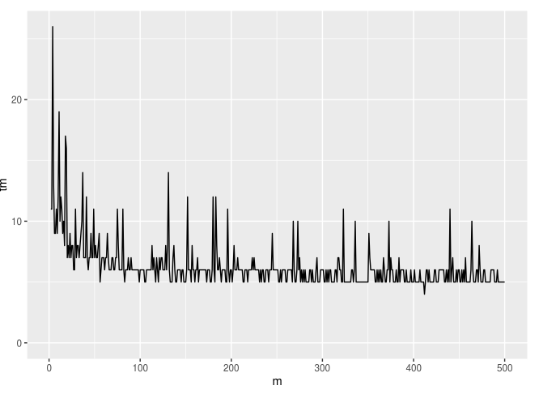
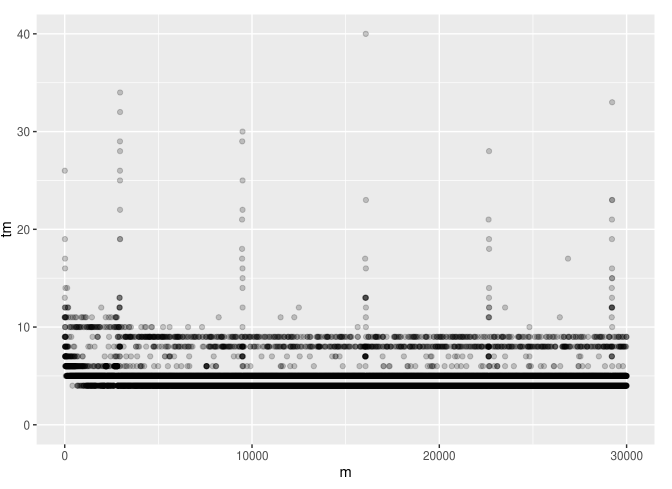

Previously presented results of Java POJO/Steam REST API scoring times of `<1ms` were misleading as we were scoring the same input,
therefore various caching effects took place.

To simulate a more realistic scenario we are streaming a test dataset one request at a time (though one should also experiment with
concurrency). The first request after deploying the servive will take a long time even 1 sec as Java classes are loaded etc. Subsequent 
times include the composition of the URL from params, making the http request (network etc.), Java scoring, returning the results etc.

It seems like the JIT needs ~100 iterations to get "warmed up":

Even after that there are "hickups" every few thousand iterations:

Otherwise after warm up most requests take 4-10ms (4ms includes the time to construct the URL, network back and forth etc.)
Hickups can cause latency of up to 40ms (or maybe if tested for longer even more), though that affects few requests.

TODO: It would be nice to know if the hickups happen because of Jetty or the POJO. Is this garbage collection?

